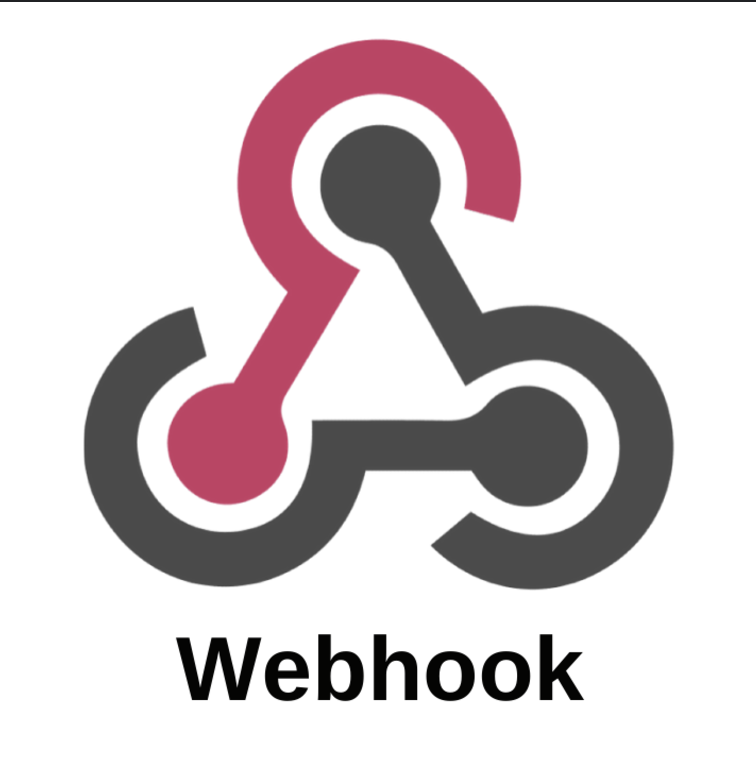

# Webhooks Plugin

A lightweight plugin that enables subscribing to system events by adding webhooks. Each registered webhook is triggered automatically when an associated event occurs, ensuring real-time notifications and seamless integration.

